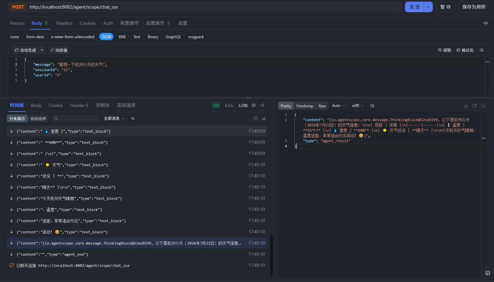

# agent-scope-java-demo

Agent + MCP 演示工程：基于 [AgentScope Java](https://github.com/agentscope-ai/agentscope-java) Harness 构建智能体服务，通过 MCP（Streamable HTTP）调用工具服务。



## 模块说明

| 模块 | 端口 | 说明 |
| --- | --- | --- |
| `mcp-server` | 8081 | 基于 Spring AI MCP Server（STREAMABLE 协议），提供示例工具：当前时间、模拟天气查询 |
| `agent-app` | 8082 | 基于 AgentScope HarnessAgent 的智能体服务，连接 MCP server 获取工具，对外提供 SSE 流式对话接口 |
| `agent-ui` | 5173 | 基于 Vite + Vue 3 的对话界面，对接 agent-app 的对话/会话接口；原型见 `agent-ui/原型/index.html` |

## 环境要求

- JDK 17+
- Maven 3.6+
- DashScope API Key（环境变量 `YOKA_DASHSCOPE_API_KEY`）

## 启动方式

```bash
# 1. 编译
mvn clean compile

# 2. 先启动 MCP server（8081）
mvn -pl mcp-server spring-boot:run

# 3. 再启动 Agent 服务（8082）
export YOKA_DASHSCOPE_API_KEY=sk-xxxx
mvn -pl agent-app spring-boot:run

# 4. 启动前端界面（5173，需要先启动 agent-app）
cd agent-ui
pnpm install
pnpm dev
```

浏览器打开 `http://localhost:5173` 即可对话。前端通过 Vite 代理把 `/agent/scope/**` 转发到 `http://localhost:8082`，无需处理跨域。

界面上支持的接口：

| 界面能力 | 接口 |
| --- | --- |
| 侧栏会话列表、相对时间分组 | `GET /agent/scope/getSessions` |
| 打开会话、渲染历史消息（思考过程/工具调用/正文） | `GET /agent/scope/getMessages` |
| 发送消息、流式渲染 | `POST /agent/scope/chat_sse` |
| 停止生成（输入框右侧方块按钮） | `GET /agent/scope/interrupt` |
| 会话项悬停后的删除按钮 | `GET /agent/scope/delSession` |

说明：

- 默认用户 ID 为 `1`，可在「个人主页」里切换；`userId` 存在 `localStorage` 的 `agent-ui:userId`。
- 新建会话在发出第一条消息时才生成 `sessionId`，因此没有消息的空会话不会出现在列表里。
- 个人主页的用量/费用/图表是**演示数据**（后端暂无对应接口），页面上已标注。
- 附件、选择工具、模型切换为占位控件（禁用状态）；顶栏 ⋯ 菜单可把**当前会话的对话正文导出为 Markdown / HTML / PDF**（三者内容一致，均不含思考过程与工具调用；流式中或空会话时该项置灰）。PDF 走浏览器打印，会弹出系统打印对话框，在对话框里选「另存为 PDF」。
- 侧栏左下角头像点开是菜单（个人主页 / 退出），其中「退出」暂未实现；侧栏头部按钮可收起侧栏（窄屏关抽屉，宽屏折叠整列，顶栏汉堡按钮展开）。
- 流式过程中后端不返回工具的成功/失败信号，所以工具卡片一律按「成功」收尾（仅当整个流报错时才标记失败）；历史消息里可依据 `state` 字段准确还原。

可选环境变量：

| 变量 | 默认 | 说明 |
| --- | --- | --- |
| `YOKA_DASHSCOPE_API_KEY` | 无（必填） | DashScope API Key |
| `MCP_SERVER_TOKEN` | 空 | MCP server 访问令牌，为空时不附加 Authorization 头 |

## 接口示例

流式对话（SSE）：

```bash
curl -N -X POST http://localhost:8082/agent/scope/chat_sse \
  -H "Content-Type: application/json" \
  -d '{"userId":"1","sessionId":"11","message":"查询一下杭州今天的天气"}'
```
返回结果:
``` text
data:{"content":"","type":"agent_start"}

data:{"content":"The","type":"thinking"}

data:{"content":" user wants to check","type":"thinking"}

data:{"content":" the weather in Hang","type":"thinking"}

data:{"content":"zhou today","type":"thinking"}

data:{"content":". Let me first","type":"thinking"}

data:{"content":" get the","type":"thinking"}

data:{"content":" current date/time and","type":"thinking"}

data:{"content":" then query the weather","type":"thinking"}

data:{"content":" for Hangzhou.","type":"thinking"}

data:{"toolCall":{"toolCallId":"call_fff3b2bcfc62485485078ba0","toolName":"get_current_datetime","toolParams":"{}"},"type":"tool_call"}

data:{"toolCall":{"toolCallId":"call_fe8265ffb6554f449ea452c8","toolName":"queryWeather","toolParams":"{\"city\": \"杭州\"}"},"type":"tool_call"}

data:{"toolCall":{"toolCallId":"call_fff3b2bcfc62485485078ba0","toolName":"get_current_datetime","toolResults":"2026-07-22 17:40:07"},"type":"tool_result"}

data:{"toolCall":{"toolCallId":"call_fe8265ffb6554f449ea452c8","toolName":"queryWeather","toolResults":"城市杭州天气信息，温度为25度，湿度为60%，天气状况为晴天。"},"type":"tool_result"}

data:{"content":"The","type":"thinking"}

data:{"content":" user asked","type":"thinking"}

data:{"content":" about the weather","type":"thinking"}

data:{"content":" in Hangzhou today","type":"thinking"}

data:{"content":". I have the","type":"thinking"}

data:{"content":" results now.\n","type":"thinking"}

data:{"content":"以下是杭州今天（","type":"text_block"}

data:{"content":"202","type":"text_block"}

data:{"content":"6年7月","type":"text_block"}

data:{"content":"22日","type":"text_block"}

data:{"content":"）的天气信息：","type":"text_block"}

data:{"content":"\n\n|","type":"text_block"}

data:{"content":" 项目 | ","type":"text_block"}

data:{"content":"详情","type":"text_block"}

data:{"content":" |\n|------","type":"text_block"}

data:{"content":"|------|\n","type":"text_block"}

data:{"content":"| 🌡","type":"text_block"}

data:{"content":"️ 温度 |","type":"text_block"}

data:{"content":" **","type":"text_block"}

data:{"content":"25°C**","type":"text_block"}

data:{"content":" |\n|","type":"text_block"}

data:{"content":" 💧 湿度 |","type":"text_block"}

data:{"content":" **60%**","type":"text_block"}

data:{"content":" |\n|","type":"text_block"}

data:{"content":" ☀️ 天气","type":"text_block"}

data:{"content":"状况 | **","type":"text_block"}

data:{"content":"晴天** |\n\n","type":"text_block"}

data:{"content":"今天杭州天气晴朗","type":"text_block"}

data:{"content":"，温度","type":"text_block"}

data:{"content":"适宜，非常适合外出","type":"text_block"}

data:{"content":"活动！😊","type":"text_block"}

data:{"content":"[io.agentscope.core.message.ThinkingBlock@12ed8199, 以下是杭州今天（2026年7月22日）的天气信息：\n\n| 项目 | 详情 |\n|------|------|\n| 🌡️ 温度 | **25°C** |\n| 💧 湿度 | **60%** |\n| ☀️ 天气状况 | **晴天** |\n\n今天杭州天气晴朗，温度适宜，非常适合外出活动！😊]","type":"agent_result"}

data:{"content":"","type":"agent_end"}

```

历史消息：`GET /agent/scope/getMessages?userId=u1&sessionId=s1`

会话列表：`GET /agent/scope/getSessions?userId=u1`

中断会话：`GET /agent/scope/interrupt?userId=u1&sessionId=s1`

API 文档：启动 agent-app 后访问 `http://localhost:8082/doc.html`（Knife4j）。

## 说明

- 智能体状态与上下文默认存储在 `~/.agentscope` 目录下（JsonFileAgentStateStore）。
- `AgentConfig` 中工具权限模式为 `PermissionMode.BYPASS`（不校验权限），仅供演示，生产环境请勿使用。
